# education
2020 ~ 2022 공부

### 대학교
- 
- 
- ()
- 
- 
- 
- 
- 

학교에서 위와 같은 과목들을 배웠습니다.

### 학원
- 
- 
- ,,()
- 
- Servlet/JSP, Ajax
- 

학원에서 위와 같은 과목들을 배웠습니다.

***

### 진행 프로젝트

1. Console Project(JAVA)
> 소개 : 치과에서 이용 가능한 프로그램으로써 환자는 자신의 진료를 예약관리/이전 진찰 확인 등을 할 수 있고, 관리자는 예약관리/진료관리/병원관리 등의 시스템을 이용할 수 있게 개발되었습니다.

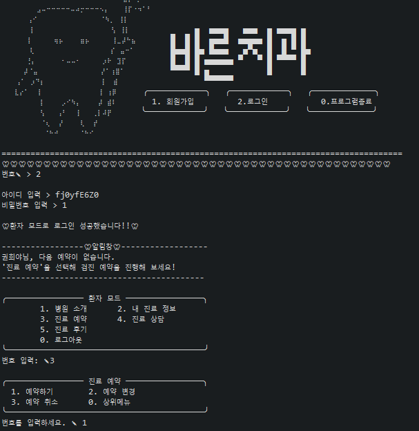

> 환자는 로그인 or 회원가입 후 서비스를 이용할 수 있으며, 사진에서와 같이 다양한 메뉴를 이용할 수 있습니다. 
> 그 중 예약하기 메뉴에 대한 소개입니다.

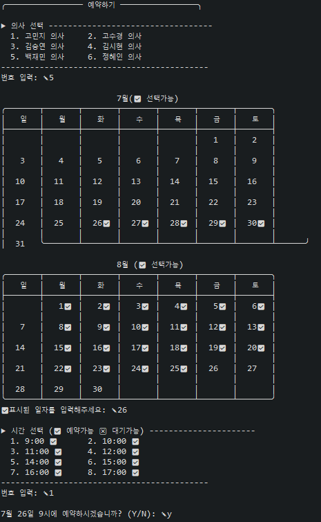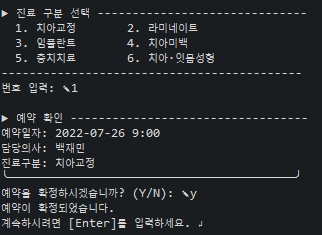
> 환자는 예약메뉴 이용 시 원하는 의사를 선택하고 해당 의사의 스케줄에 비어있는 시간을 선택합니다. 
> 이후 치료 목적을 선택 후 최종 예약 형태를 확인 후 예약 최종 결정을 처리하게 됩니다.

***
해당 시스템에서 제가 맡게 된 부분은 관리자 파트의 직원 정보/매출액/재고 관리 부분입니다.

콘솔 출력 이미지 보기

   
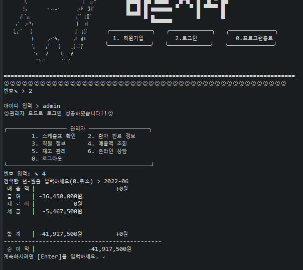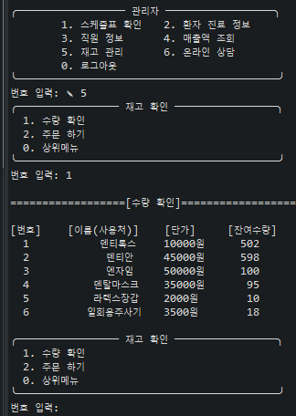
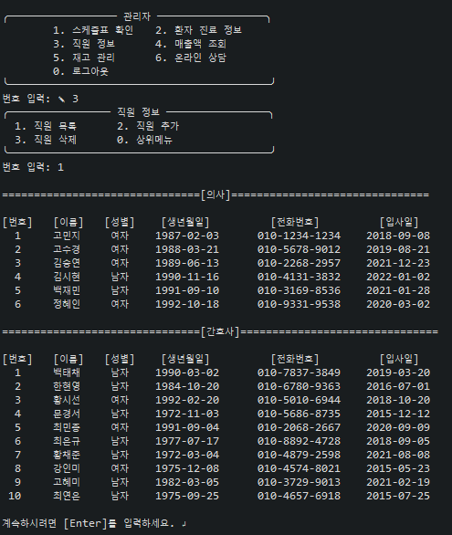

매출액을 조회하는 부분입니다.&nbsp;&nbsp;&nbsp;&nbsp;&nbsp;&nbsp;&nbsp;&nbsp;&nbsp;&nbsp;&nbsp;&nbsp;&nbsp;&nbsp;재고 관리 부분입니다.&nbsp;&nbsp;&nbsp;&nbsp;&nbsp;&nbsp;&nbsp;&nbsp;&nbsp;&nbsp;&nbsp;&nbsp;&nbsp;&nbsp;&nbsp;&nbsp;직원 관리 부분입니다.

<dl>
  <dt><a href=".\01_자바 콘솔프로젝트\07. 소스\ConsoleProject2\src\com\project\dentist\admin\sales">매출 관리 코드 보기</a></dt>
  <dd>위의 주소에서는 매출액 조액에 이용되었던 코드와 직원들의 월급관리 코드를 살펴보실 수 있습니다.</dd>
  <dt><a href=".\01_자바 콘솔프로젝트\07. 소스\ConsoleProject2\src\com\project\dentist\admin\inventory">재고 관리 코드 보기</a></dt>
  <dd>위의 주소에서는 재고 관리에 이용되었던 재고 조회, 재고 자동 주문 시스템 관리 코드를 살펴보실 수 있습니다.</dd>
  <dt><a href=".\01_자바 콘솔프로젝트\07. 소스\ConsoleProject2\src\com\project\dentist\admin\adminDiagnosis\DiagnosisWrite.java">재고 차감</a> </dt>
  <dd>위의 주소에서는 재고 차감에 이용되는 코드 <useItems>를 확인 하실 수 있습니다.
  <dt><a href=".\01_자바 콘솔프로젝트\07. 소스\ConsoleProject2\src\com\project\dentist\admin\adminEmployee">직원 관리 코드 보기</a></dt>
  <dd>위의 주소에서는 직원 관리에 이용되었던 코드로서 직원 추가/직원 조회 코드를 살펴보실 수 있습니다.</dd>
</dl>

해당 코드들에서 주로 이용된 문법으로 lambda / for문 (+향상된 for문) / if / switch문 / array / File 입·출력 / 함수 를 이용해 프로그램의 코드를 구성했습니다.

***
2. DataBase Project
- Naver Movie
> 소개: 네이버영화의 정보를 이용해 데이터베이스의 이용될 테이블과 컬럼을 나누는 소규모 작업이였습니다.

네이버영 ERD보기

     

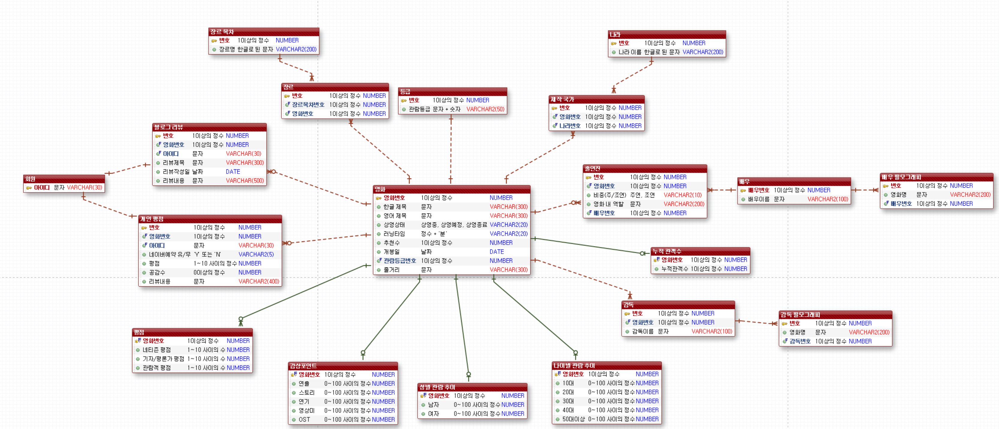

- Management Project (for Oracle)
> 소개: 쌍용교육센터의 관리 프로그램을 제작하는 프로젝트였습니다.

  
교육센터 ERD보기

     

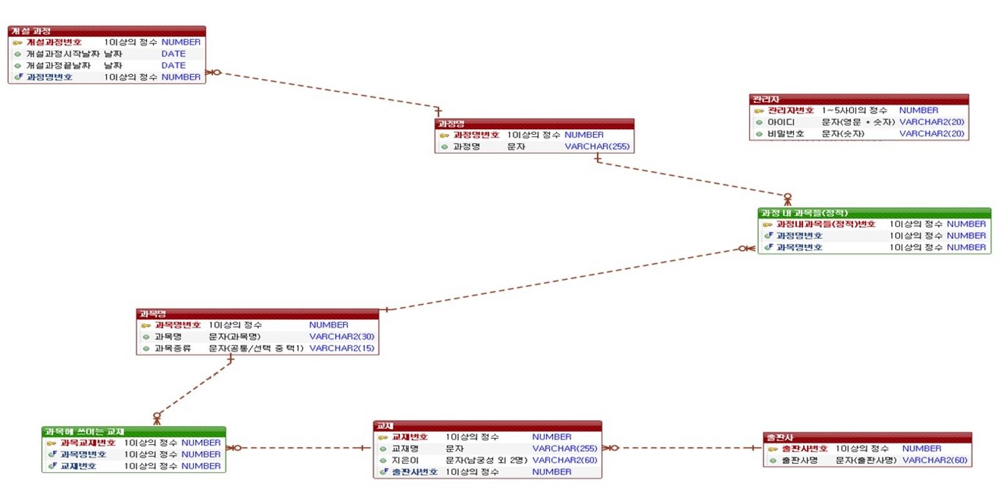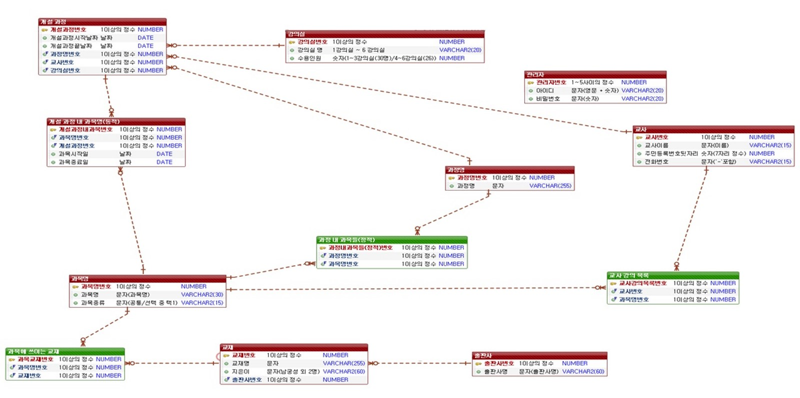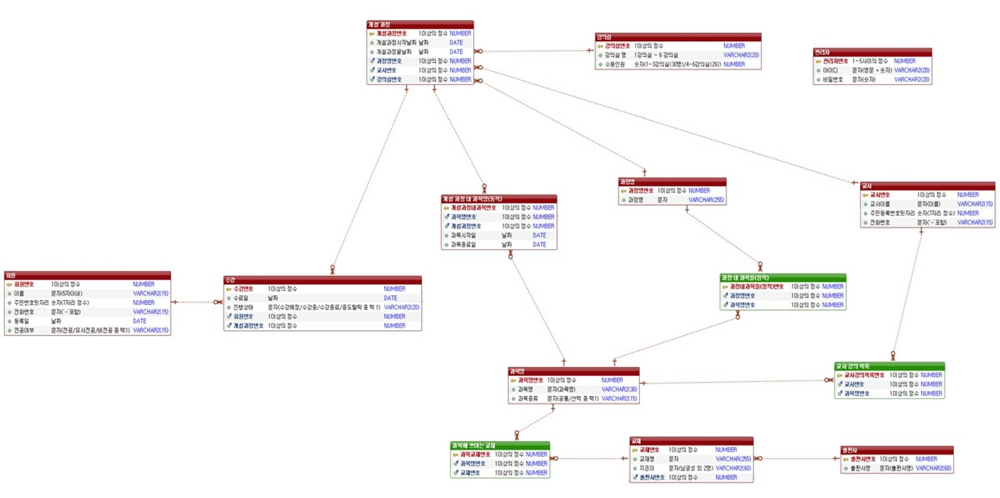

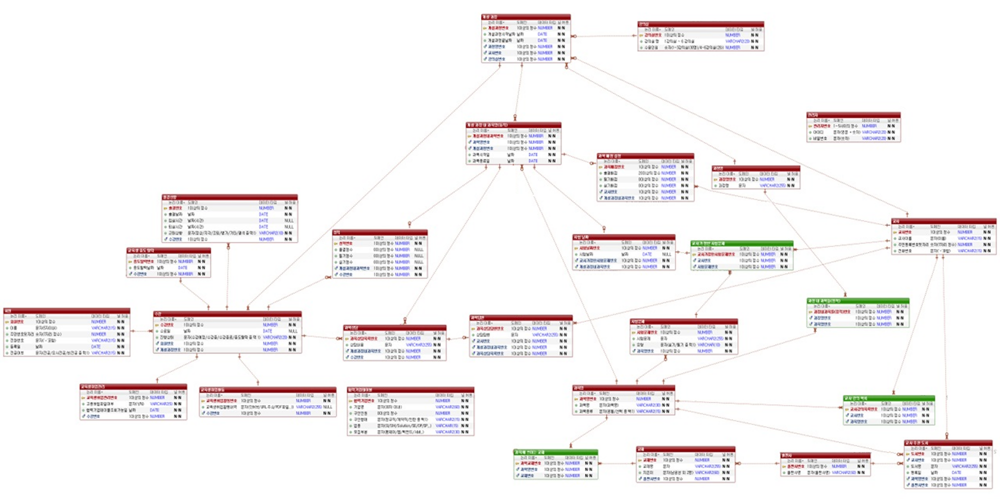
  
<전체 모습>

  
해당 프로젝트에서 저의 파트는 관리자/교사/학생 파트 중 교사 파트입니다.
  
- 내 강의 스케줄 조회하기
- 성적 입출력
- 학생 출결 조회
- 추천도서 관리
  
위의 부분을 담당하게 되었습니다.

  <bold>
출력결과 화면 보기
</bold>

  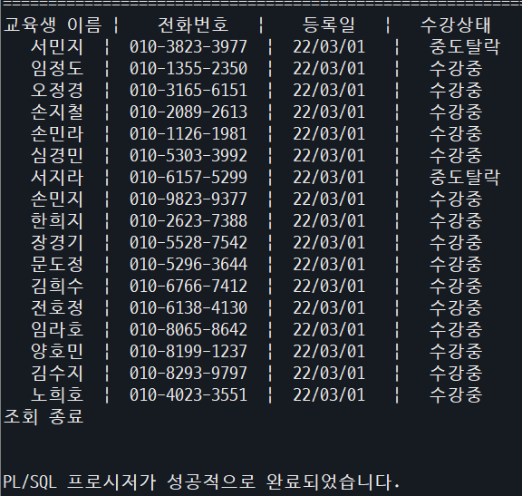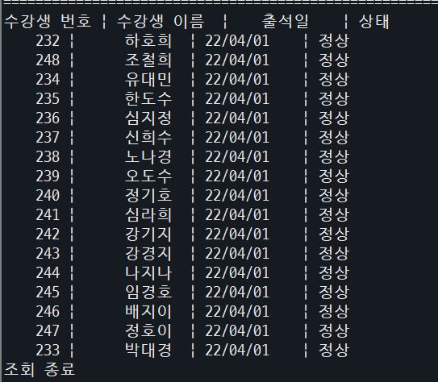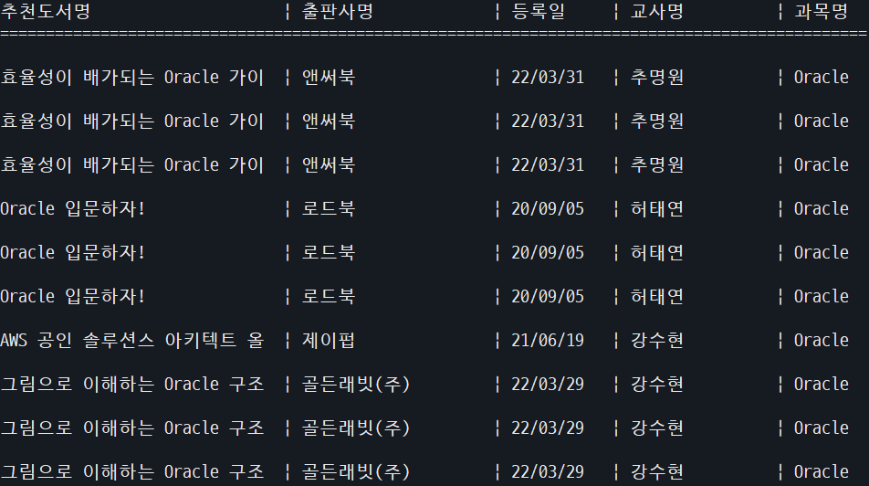

  
<a href=".\02_SQL_오라클 프로젝트\ANSI_PLSQL 프로젝트\7. PL-SQL\교사">사용한 코드 보러가기</a>

위의 주소로 이동하면 이용한 코드를 확인할 수 있습니다.
  

해당 프로젝트에서는 ddl / dml / select / inner join / outer join / sub Query 등을 이용하였습니다.

  

***

3. Web Project(Servlet / JSP)
  
> 소개: 국내 숙소 / 렌터카 / 액티비티 예약 관리 웹프로젝트입니다.

예약 사이트 ERD보기

     

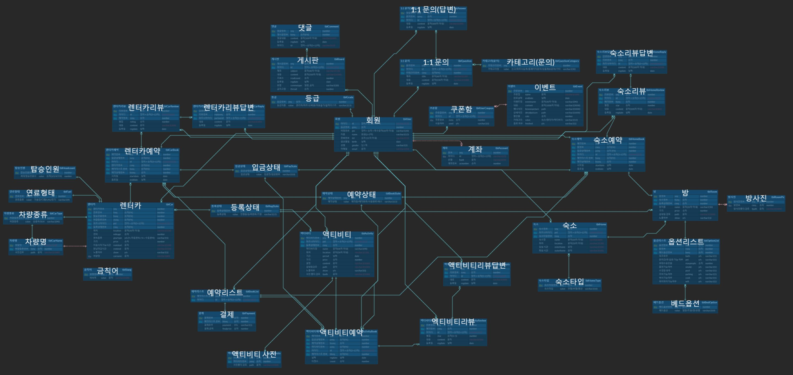

해당 프로젝트에서 저의 파트는 숙소 예약 파트를 담당했습니다.

구현 이미지 보기

     

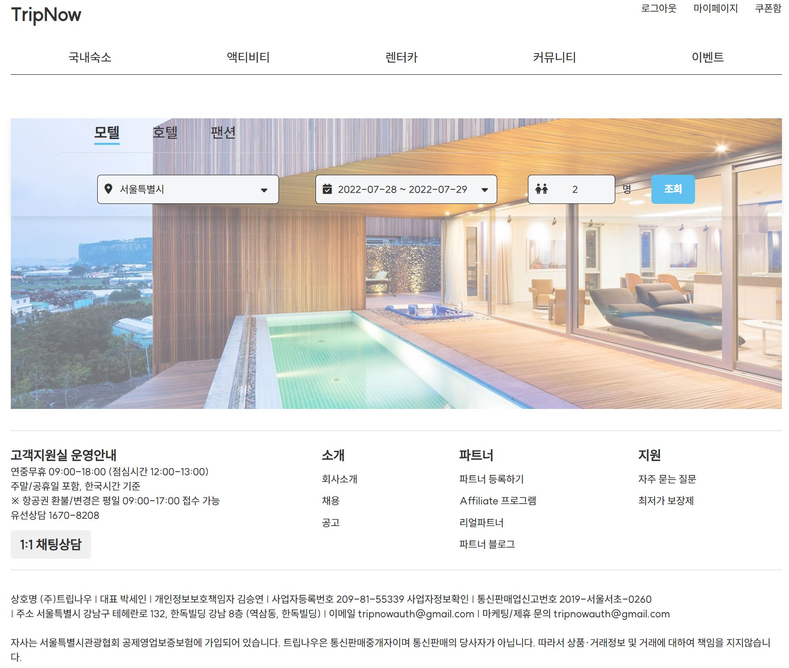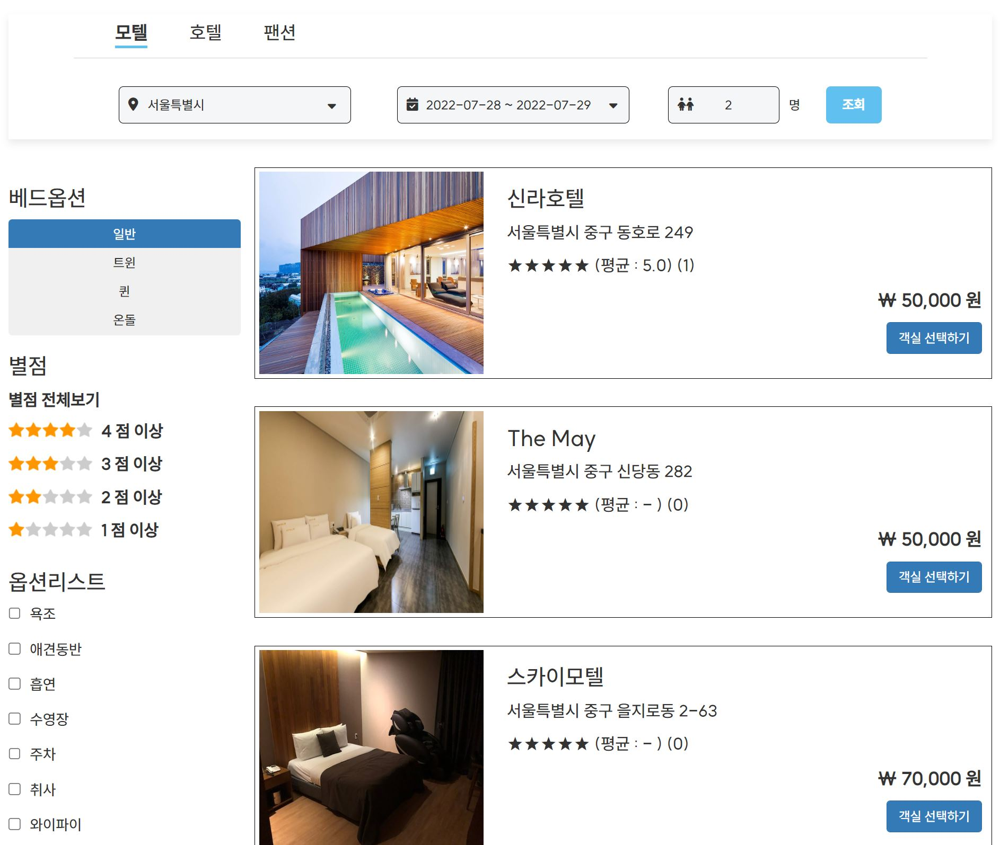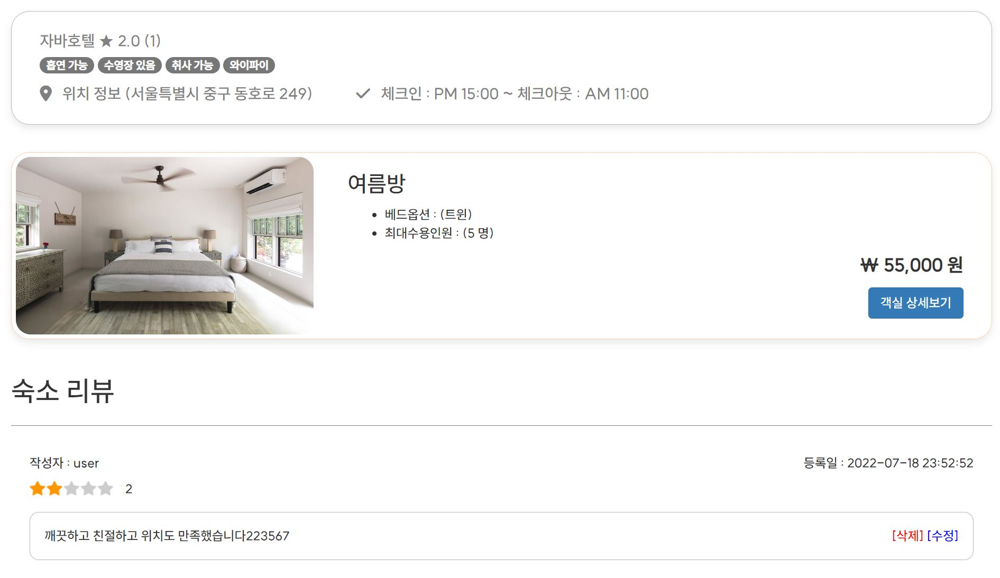
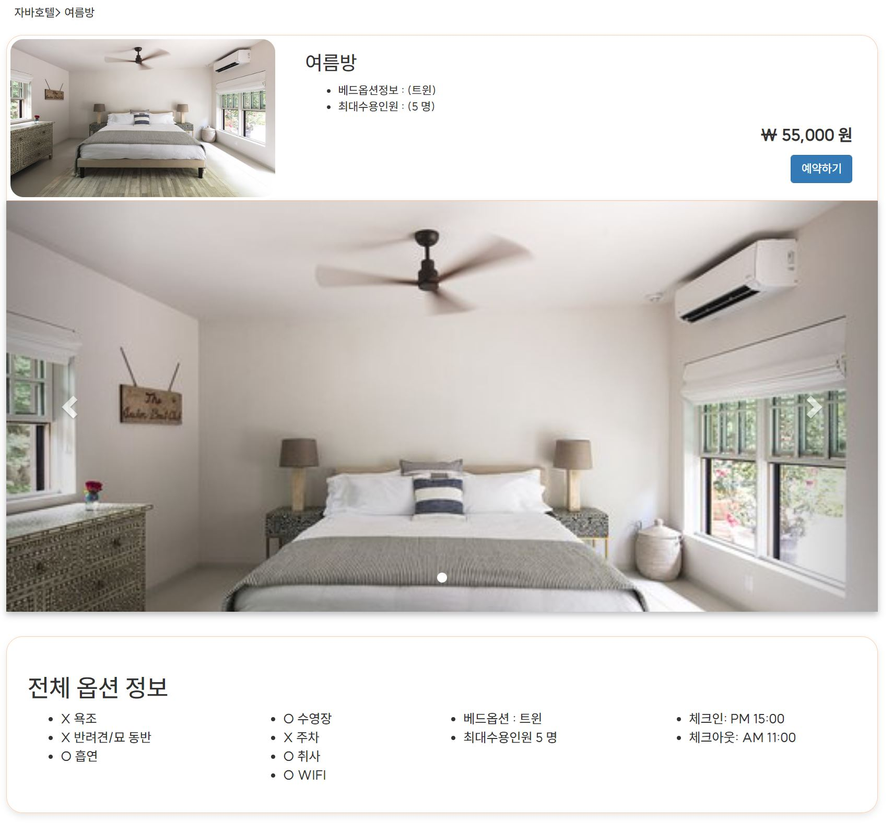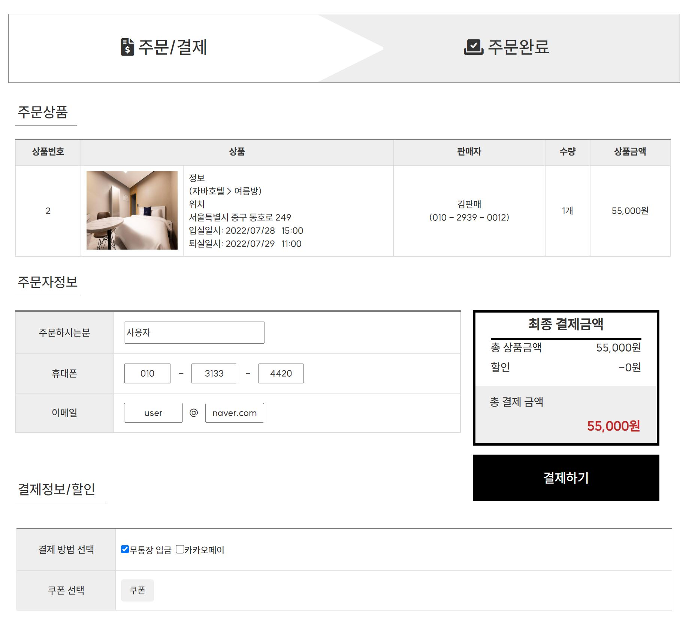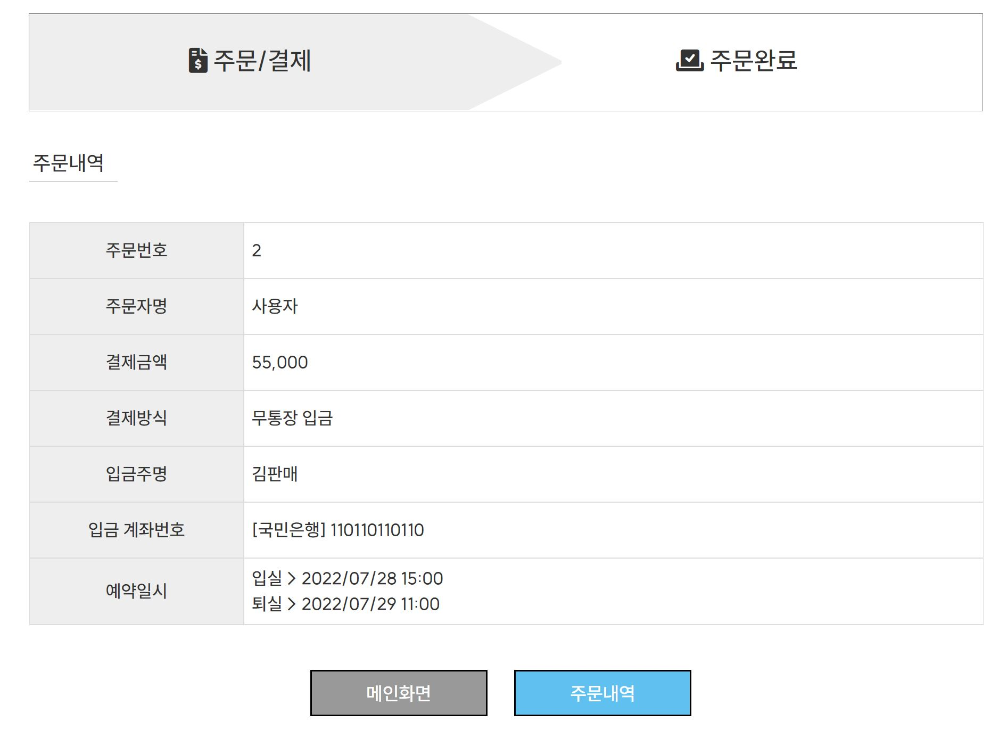

아직 해당 프로젝트는 완벽하게 구현된 상태가 아니지만 현재 다 하지 못한 나머지 업무를 처리중에 있습니다.

[TOP△](#)
